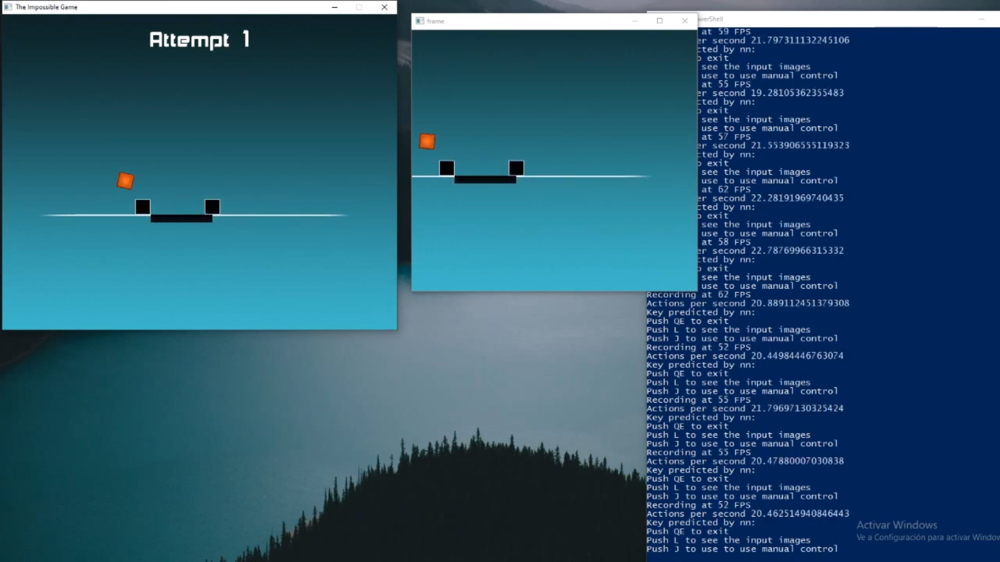
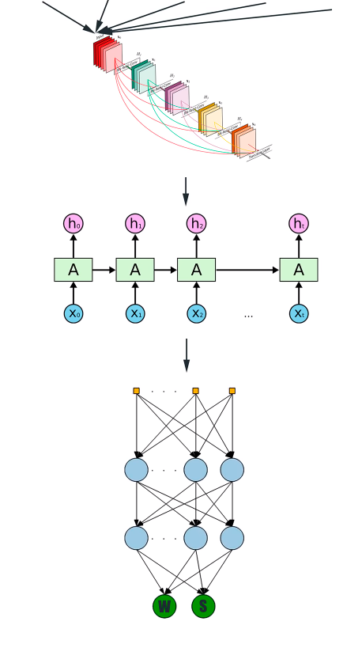

# Impossible Game AI
A neural network trained to beat the impossible game

  

## How does it work

  

This network learns from examples of people playing the game, so we need to record the data beforehand. Because we dont want out network to learn from people mistakes, we remove automatically the deaths fragments in the original videos. Once all this is done, and after some light preprocesing, the data is packed in a compressed numpy file, which is used to train the model.

We can test our model by running the game and letting the neural network decide when It has to jump. 

## Do you need powerful hardware to run the network
Yes, but if the neural network lacks speed, you can always try reducing the speed of the game using LINK CHEAT ENGINE

## Reference
[Video](https://youtu.be/u9vJA7DSV2c)

This project is based on: 
https://github.com/ikergarcia1996/Self-Driving-Car-in-Video-Games
